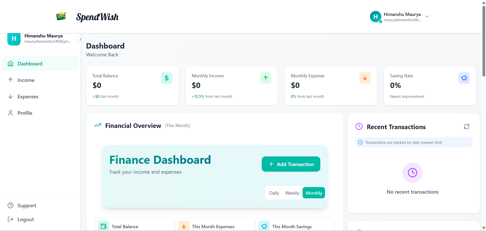

# Spendwish

Spendwish is a full-stack expense and income tracking platform that helps users manage personal finances through a clean web experience. It includes secure authentication, income tracking, expense tracking, dashboard analytics, profile management, and Excel export support.

---

## What is Spendwish?

Spendwish allows you to:

- Create a secure user account
- Sign in and manage your profile
- Track income records
- Track expense records
- View financial summaries from a dashboard
- Filter transactions by date ranges
- Export transaction data to Excel
- Manage data with a Node.js and MongoDB backend

---

## Preview

```text
Add screenshots inside a screenshots folder, then update these image paths.
```

<p align="center">
  
  &nbsp;&nbsp;&nbsp;
  
</p>

---

## Technology Stack

| Layer | Technology |
|-------|------------|
| Frontend | React + Vite + Tailwind CSS |
| Backend | Node.js + Express.js |
| Database | MongoDB + Mongoose |
| Authentication | JWT + bcryptjs |
| Charts | Recharts |
| Icons | Lucide React |
| Export | XLSX |

---

## Key Features

- User signup and login
- JWT-based protected routes
- Income management
- Expense management
- Dashboard summary for financial activity
- Profile update and password change support
- Date-based transaction filtering
- Excel export for transaction records
- Responsive UI for desktop and mobile
- MongoDB storage with Mongoose models

---

## Project Structure

```text
SpendWise/
+-- backend/     # Express API, MongoDB models, routes, and controllers
+-- frontend/    # React, Vite, and Tailwind CSS frontend app
+-- README.md
```

---

## Local Development Setup

### Backend Setup

```bash
cd SpendWise/backend
npm install
npm start
```

Backend runs at:

```text
http://localhost:4000
```

### Backend Environment Variables

Create a `.env` file inside the `backend` folder:

```properties
PORT=4000
```

MongoDB is currently configured in:

```text
backend/config/db.js
```

Default local database:

```text
mongodb://localhost:27017/expenseTracker
```

---

### Frontend Setup

```bash
cd SpendWise/frontend
npm install
npm run dev
```

Frontend usually runs at:

```text
http://localhost:5173
```

---

## Available Scripts

| Folder | Command | Description |
|--------|---------|-------------|
| backend | `npm start` | Start Express server with Nodemon |
| frontend | `npm run dev` | Start Vite frontend app |
| frontend | `npm run build` | Build frontend for production |
| frontend | `npm run lint` | Run ESLint |
| frontend | `npm run preview` | Preview production build |

---

## API Routes

| Route | Description |
|-------|-------------|
| `/api/user` | User signup, login, profile, and password APIs |
| `/api/income` | Income record APIs |
| `/api/expense` | Expense record APIs |
| `/api/dashboard` | Dashboard summary APIs |

